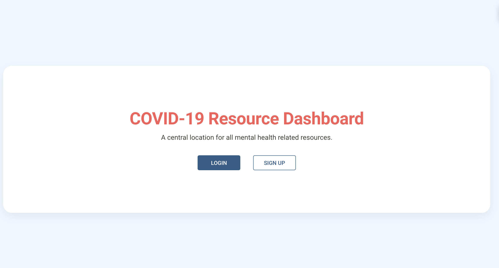
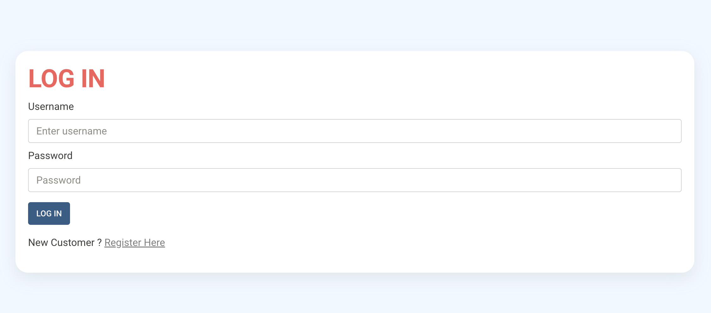
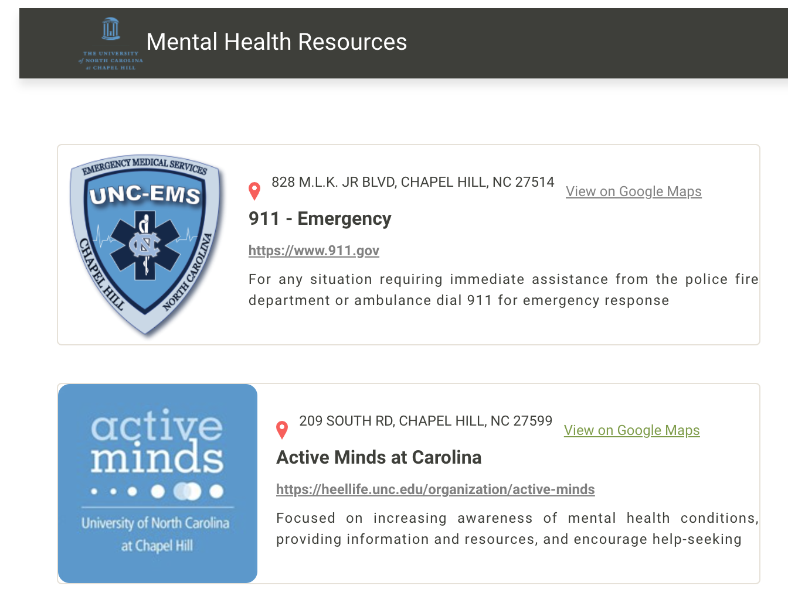

# a99 Final Project

# Group Members

Daniel, Madyson, Maytee, Meghan, and Sonika

# Mental Health Database

A database that provides information about mental health resources in the general Chapel Hill area. All you need to do to have access is to register for an account to access the dashboard. Each resource provides the website, a phone number, email, and more.

### The Welcome Page



### The Login Page



### The Dashboard of Resources



## Installing / Getting started

A quick introduction of the minimal setup you need to get a hello world up &
running.

```shell
git clone https://github.com/comp426-2022-spring/a99-unukalhai.git
```

Create a clone of this repo on your local device.

#### Backend

```shell
cd backend
npm install bcrypt body-parser cookie-parser cors dotenv express is-empty jsonwebtoken mongoose nodemon validator
```

Install dependecies in backend folder

```shell
nodemon server
```

How to run the server

#### Frontend

```shell
cd frontend
npm install axios react-bootstrap react-router-dom
```

Install these dependencies in frontend folder

```shell
cd frontend
npm start
```

How start the frontend

## Developing

### Built With

MERN Stack (MongoDB, Express.js, React.js, Node.js)

## Licensing

The project is licensed under the GPLv3.
