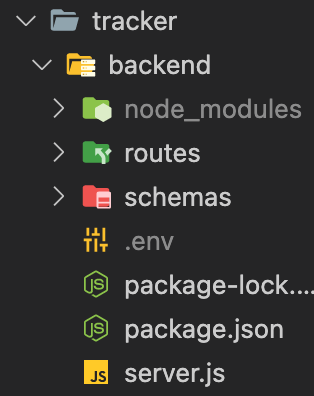
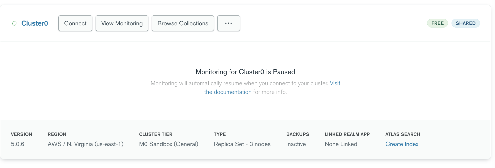
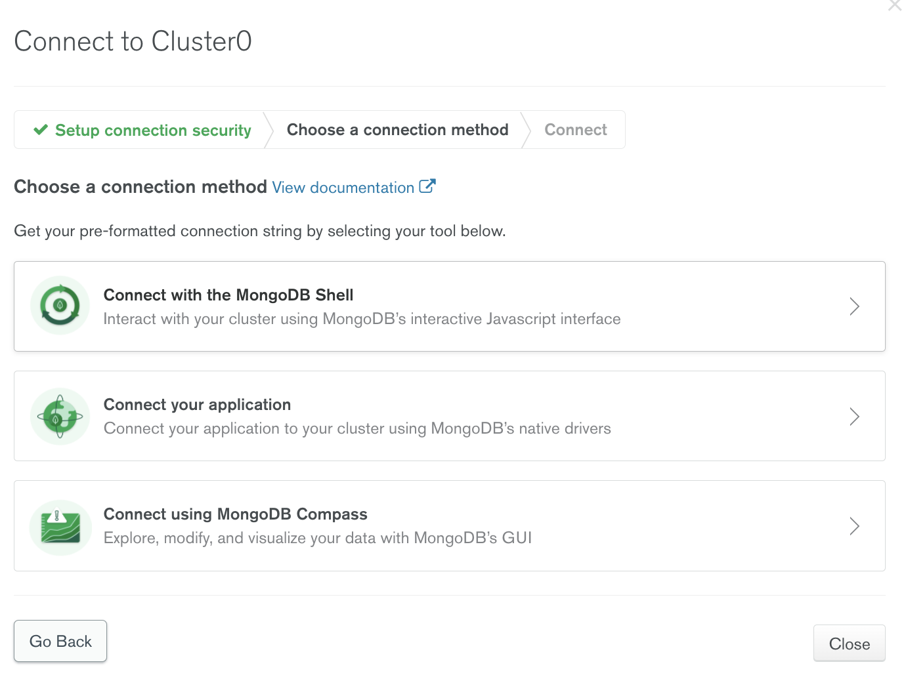
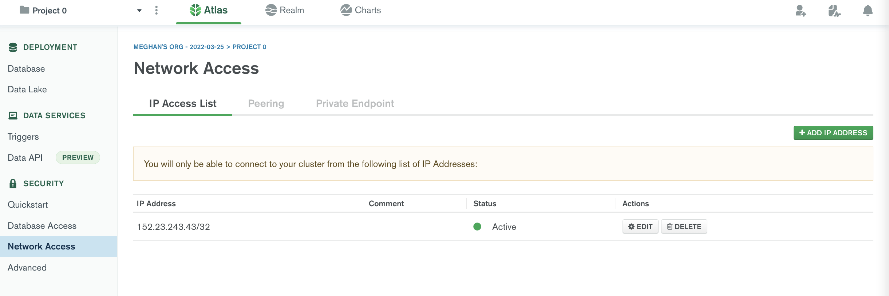

# SERVER SET UP

## Part 00: Installing Libraries

- go to backend directory: `cd backend`
- run `npm install express cors dotenv mongoose nodemon`

**Note: I forgot to tell you guys to install nodemon earlier!**

## Part 01: Connecting to MongoDB

- Create an `.env` file in `backend` directory

    

- Create variable `ATLAS_URI`
- Go to MongoDB project page, and hit **Connect** -> **Connect your application** -> copy & paste connection string and set it to `ATLAS_URI` (would look something like `ATLAS_URI`=mongodb+srv:....)
   
- Make sure to replace 'password' (including < >) substring with our user password (will text in the groupMe)

## Part 02: Adding Your IP Address

- Go to `Network Access` tab on the left side
- Hit `Add IP Address` green button

    

## Part 03: Running Server

- To start the server, run `nodemon server.js`
